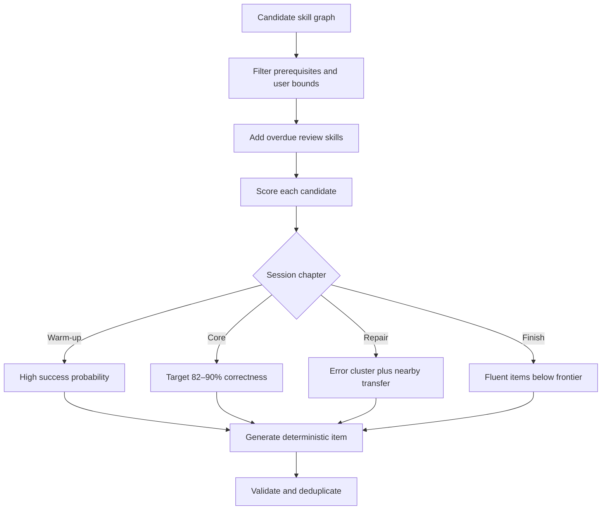

# Mental Maths Arena — Product and Engineering Plan

**Status:** Proposed for review  
**Product type:** Local-first, account-ready progressive web application  
**Core promise:** Every session should find the narrow band where the learner is accurate enough to build confidence and stretched enough to improve speed.

## 1. Product direction

This is a serious daily training instrument, not a landing page with a quiz attached. The default screen opens directly into **Today**, showing the learner's readiness, prescribed workout, current streak, and the one action that matters: starting the session.

### Audience

- Primary: teens and adults who want visibly faster everyday arithmetic.
- Secondary: students preparing for timed tests and parents/teachers reviewing progress.
- Usage pattern: 5–20 minutes most days, plus occasional longer diagnostics and custom workouts.

### Tone and visual identity

- **Tone:** focused, energetic, precise, warm—not childish and not corporate.
- **Direction:** a dark graphite “training desk” with warm paper-white practice surfaces, electric lime for momentum, cobalt for information, amber for caution, and coral only for errors.
- **Typography:** a characterful display face for scores/headings; highly legible tabular numerals for problems, timers, and charts; ordinary UI copy remains calm and compact.
- **Memorable detail:** the **Pace Line**, a thin live trace that compares the current answer rhythm with the learner's recent personal baseline without turning each question into a stressful stopwatch.
- **Motion:** short, functional transitions for answer confirmation, streak changes, and chart focus. Reduced-motion mode removes all nonessential movement.

### Product pillars

1. **Train, do not merely test.** Every question has a reason to appear.
2. **Speed with correctness.** Fast guessing is not rewarded; latency matters only after accuracy is stable.
3. **Visible progress.** The learner can explain what improved today and over the last week.
4. **Respect attention.** Keyboard-first input, no interstitial clutter, no manipulative streak loss.
5. **Adapt transparently.** Difficulty changes are explainable and reversible.

## 2. Information architecture

The product has six durable areas rather than a collection of disconnected pages.

| Area | Primary job | Key screens |
|---|---|---|
| Today | Begin the recommended work immediately | Daily briefing, workout preview, quick start |
| Practice | Run focused or custom sessions | Session player, pause, summary, correction loop |
| Skill Map | Inspect and choose arithmetic skills | Mastery grid, skill detail, prerequisite path |
| Progress | Understand change over time | Overview, speed/accuracy, consistency, records |
| Challenges | Add variety without corrupting core metrics | Daily challenge, sprints, personal best attempts |
| Settings | Control experience and data | Accessibility, difficulty policy, profile, export |

On compact screens these become five bottom-navigation destinations, with Settings under the profile menu. During a session, navigation disappears and the problem surface gets the full viewport.

## 3. Core learner journey

```mermaid
flowchart LR
    A[First launch] --> B[Preferences and accessibility]
    B --> C[12–18 question calibration]
    C --> D[Initial skill estimates]
    D --> E[Today's prescribed workout]
    E --> F[Warm-up]
    F --> G[Adaptive core]
    G --> H[Targeted repair]
    H --> I[Fluency finish]
    I --> J[Session debrief]
    J --> K[Daily model update]
    K --> L[Tomorrow's prescription]
    J --> M[Optional correction review]
    M --> K
```



### First launch

1. Pick a display name and session length (5, 10, 15, or 20 minutes).
2. Set input preferences: number row, numeric keypad, on-screen keypad, or mixed.
3. Set accessibility options before timing begins.
4. Complete a short calibration that samples broad skill families and stops early when confidence is sufficient.
5. Land on a populated Today view—never an empty analytics dashboard.

### Daily workout structure

Each recommended workout is divided into visible chapters:

1. **Warm-up (10–15%)** — recent mastered items at comfortable pace.
2. **Adaptive core (50–60%)** — skills near the target challenge band.
3. **Repair (15–25%)** — recent misconceptions and slow-but-correct patterns.
4. **Fluency finish (10–15%)** — easier items optimized for smooth rhythm and a positive ending.

The user can inspect the rationale (“Division facts are due; complements to 100 slowed yesterday”) and swap one chapter, but cannot unknowingly turn a prescribed session into an incomparable benchmark.

## 4. Practice modes

### Recommended modes

- **Daily Workout:** adaptive, mixed, progress-bearing default.
- **Focused Practice:** one skill family with optional difficulty bounds.
- **Weak Spot Repair:** generated from error clusters and slow correct responses.
- **Review Queue:** spaced retrieval of due patterns.
- **Placement Check:** recalibrates estimates after time away or obvious mismatch.

### Performance modes

- **60-second Sprint:** stable item pool and strict comparability rules.
- **Three-minute Endurance:** measures sustained pace and fatigue slope.
- **Personal Best:** fixed seed and skill mix for fair self-comparison.
- **Daily Challenge:** identical seeded set for all local profiles; separate leaderboard-ready contract.

### Learning modes

- **Strategy Lab:** untimed worked examples for decomposition, complements, doubling/halving, and estimation.
- **Error Replay:** similar-but-not-identical questions after a short delay.
- **Zen Mode:** no visible timer or streak; timing is recorded only if the learner opts in.
- **Custom Workout Builder:** skill, operand range, sign rules, duration, and pacing controls.

Performance-mode results never directly inflate mastery. They can provide weak evidence, but training data remains the main signal.

## 5. Skill taxonomy and content system

Questions are generated from typed templates, not stored as a giant list. Every generated item carries metadata for analysis and adaptation.

### Initial skill graph

| Family | Skills |
|---|---|
| Addition | facts to 20, complements to 10/100/1000, two-digit, three-digit, decimals, negatives |
| Subtraction | facts to 20, bridging tens, two-/three-digit, decimals, negatives |
| Multiplication | tables 2–12, extended facts, two-by-one digit, two-by-two digit, decimals, doubling/halving |
| Division | inverse facts, remainders, exact multi-digit, decimal quotients, factor cancellation |
| Fractions | equivalence, simplify, compare, fraction of amount, add/subtract, multiply/divide |
| Percentages | benchmark percentages, percentage of amount, increase/decrease, reverse percentage |
| Ratios | simplify, scale, missing value, unit rate, proportional reasoning |
| Powers & roots | squares, cubes, square roots, powers of ten |
| Estimation | rounding, magnitude, approximate operations, reasonableness checks |
| Applied arithmetic | money, time, unit conversion, averages, mixed expressions |

### Question contract

Every item contains:

- stable template ID and generator version;
- skill and prerequisite tags;
- numerical difficulty feature vector;
- prompt, accepted answer type, exact answer, and tolerant comparison policy;
- estimated expert time and current learner target time;
- strategy hints and a worked solution recipe;
- deterministic random seed;
- guards against ambiguity, triviality, overflow, and accidental repetition.

Difficulty is multidimensional. “Two digit addition” is insufficient: carry count, digit similarity, zero placement, distance from round numbers, sign, decimal places, operation switching, and working-memory depth all matter.

## 6. Session player design

### Default desktop layout

- Top rail: chapter progress, discreet elapsed time, pause, and sound toggle.
- Center: one large problem on a quiet warm surface.
- Input: prominent answer field with tabular numerals and predictable sign/decimal behavior.
- Side rail: Pace Line and recent rhythm, hidden automatically on narrow screens.
- Footer: keyboard hints only until learned; no permanent instruction clutter.

### Interaction details

- Enter submits; Backspace edits; Escape pauses; optional auto-submit is limited to unambiguous fixed-length answers.
- Correct response: immediate low-key confirmation, then 250–450 ms transition.
- Incorrect response: no red flash over the whole screen. Show the submitted answer, correct answer, and one concise strategy cue; schedule a related replay.
- Response time starts only after the problem has painted and the tab is visible.
- Pauses, tab switches, interruptions, and first-key hesitation are recorded separately.
- The timer can be hidden while still preserving speed measurement.
- Session recovery checkpoints after every answer so refresh/crash loses at most the active item.

## 7. Adaptive difficulty system

The first production version uses an interpretable per-skill model rather than a black-box ML service.

### Learner state per skill

- mastery estimate `theta` and uncertainty;
- rolling accuracy with recency weighting;
- median and robust spread of correct-response latency;
- lapse rate and consecutive-success confidence;
- exposure count and last-practiced timestamp;
- error-signature frequencies;
- fatigue sensitivity and preferred challenge band.

### Item selection



Candidate score combines:

`priority = learning_value + review_urgency + uncertainty + variety - fatigue_risk - recent_repetition`

The engine targets a high-but-not-perfect success probability. It increases number complexity only after accuracy is credible; once accurate, it tightens the target time gradually. A learner should never be promoted because of one lucky fast answer.

### Evidence update after each answer

1. Classify correctness and answer equivalence.
2. Normalize latency against the template's expected time and learner input mode.
3. Down-weight interrupted, backgrounded, ultra-fast guessed, and extreme-outlier attempts.
4. Update the skill estimate using an Elo/IRT-style residual with confidence-weighted step size.
5. Update latency only for correct, valid-timing attempts using robust statistics.
6. Record error signatures (off by ten, sign reversal, multiplication-table confusion, decimal shift, etc.).
7. Update the short-term session controller, but persist durable level changes only at stable checkpoints.

### Day-by-day progression

- End-of-session updates produce an immutable daily snapshot.
- Tomorrow's plan blends spaced review, frontier practice, and weak-spot repair.
- The reference baseline uses an exponentially weighted 7-practice-day window, not midnight-to-midnight raw averages.
- Progress compares like with like: the same skill/difficulty band, valid timing, and input mode.
- Difficulty rises when credible accuracy is at least 88% and median latency improves or remains stable across sufficient evidence.
- Difficulty falls gently after repeated struggle, not after a single bad day.
- After 7+ inactive days, uncertainty widens and the first session becomes a soft recalibration.

### Safeguards

- **Hysteresis:** separate promote and demote thresholds prevent oscillation.
- **Exposure floors:** minimum representative answers before a durable level change.
- **Content diversity:** caps on identical templates, operands, and operation runs.
- **Fatigue detection:** sustained slowdown plus error rise shifts to easier consolidation.
- **Cold-start confidence:** broad sampling before specialization.
- **Manual override:** “too easy / about right / too hard” is weak evidence, not an absolute command.
- **Explainability log:** every next-session adjustment stores a human-readable reason.
- **Deterministic replay:** generator seed and engine version make reported issues reproducible.

## 8. Metrics and analytics

### Headline metrics

- **Accuracy:** valid correct attempts / valid attempts, with a confidence interval.
- **Typical pace:** median correct-answer time, never the arithmetic mean alone.
- **Fluency score:** skill-normalized combination of accuracy and robust latency.
- **Mastery coverage:** proportion of skill graph at stable mastery thresholds.
- **Consistency:** practice days and minutes, presented without punitive streak language.

### Progress views

- Today vs personal 7-day baseline.
- Weekly speed and accuracy plotted together so tradeoffs are visible.
- Skill map with states: unseen, learning, consolidating, fluent, review due.
- Distribution view for response times, not only a single average.
- Heat map by weekday/time to reveal fatigue patterns cautiously.
- Records and milestones with the exact comparison conditions shown.
- Error explorer grouped by misconception, not merely question.
- Session replay timeline showing pace drift and chapter changes.

### Metric honesty

- Separate active answering time from wall-clock session time.
- Exclude invalid timing from speed trends but retain answers for appropriate accuracy evidence.
- Never compare a harder current set against an easier past set without normalization.
- Display sample size and label early estimates as provisional.
- Preserve historical engine/model versions so recalculation is auditable.

## 9. Technical architecture

### Repository shape

```text
apps/
  web/                 React PWA and offline session runtime
  api/                 Fastify HTTP/WebSocket service
packages/
  domain/              Pure entities, value objects, and policies
  question-engine/     Seeded generators and validators
  adaptive-engine/     Selection, evidence updates, prescriptions
  analytics/           Aggregation and normalization
  contracts/           Runtime-validated API/event schemas
  database/            Drizzle schema, migrations, repositories
  ui/                  Tokens and accessible shared components
  config/              Shared TypeScript/lint/test configuration
```

### Stack decision

- **Language:** strict TypeScript end to end.
- **Web:** React + Vite + TanStack Router/Query; PWA service worker; IndexedDB via Dexie for offline records.
- **State:** feature-local state plus a small session state machine; server cache stays in TanStack Query. Avoid a global catch-all store.
- **API:** Fastify with typed schema validation and explicit versioned contracts.
- **Database:** PostgreSQL + Drizzle; append-only attempts and daily snapshots; Redis is optional later for leaderboards and rate limiting.
- **Charts:** a lightweight accessible SVG layer, using a mature chart library only if bundle and a11y checks justify it.
- **Tooling:** pnpm workspaces, Vitest, Testing Library, Playwright, fast-check, ESLint, Prettier, Changesets, Docker Compose for local infrastructure.
- **Observability:** structured logs, request IDs, client error boundary reporting, performance marks, and opt-in anonymized product events.

### Boundary rule

Question generation, scoring, adaptation, and analytics are pure packages. UI and persistence depend on those packages; the domain never depends on React, HTTP, IndexedDB, or PostgreSQL. This enables deterministic tests and lets offline and cloud modes share identical learning logic.

### Offline and sync

```mermaid
sequenceDiagram
    participant UI as Session UI
    participant Local as IndexedDB log
    participant Sync as Sync worker
    participant API as API
    participant DB as PostgreSQL
    UI->>Local: Append attempt and checkpoint
    Local-->>UI: Durable acknowledgement
    Sync->>Local: Read unsynced events
    Sync->>API: Idempotent event batch
    API->>DB: Insert by event UUID
    DB-->>API: Accepted/already present
    API-->>Sync: Cursor and server snapshot
    Sync->>Local: Mark synced; reconcile snapshot
```

Guest mode is fully functional. Account creation upgrades the same local profile to cloud sync. Conflicts are avoided by treating attempts as immutable events; profile/settings conflicts use field-level timestamps. A session never waits on the network.

## 10. Data model

### Core records

- `users`, `profiles`, `devices`
- `skills`, `skill_prerequisites`, `question_templates`, `generator_versions`
- `sessions`, `session_chapters`, `attempts`, `attempt_timing_segments`
- `skill_estimates`, `daily_skill_snapshots`, `daily_plans`
- `error_signatures`, `review_queue_items`, `achievements`
- `preferences`, `accessibility_settings`, `sync_cursors`

### Attempt invariants

- Attempts are append-only and identified by client-generated UUID.
- Raw prompt payload, answer, correctness, timing validity, skill tags, feature vector, seed, and engine version are retained.
- Any corrected classification is a new audit record, not a destructive overwrite.
- Personally identifying profile data is stored separately from learning telemetry.

## 11. Reliability, privacy, and security

- Local-first guest profile with a complete JSON/CSV data export.
- Explicit opt-in for telemetry and cloud sync.
- No third-party advertising, fingerprinting, or sale of learning data.
- Passwordless/OAuth account layer only when cloud sync ships; secure, rotating sessions and CSRF-safe flows.
- Runtime schema validation at API, storage, import, and worker boundaries.
- Rate limits and abuse controls on public challenges/leaderboards.
- Strict content security policy; no question or nickname rendered as raw HTML.
- Database backups and tested restore procedure before calling sync production-ready.
- Delete-account flow removes server data and clearly distinguishes local copies on other devices.
- Privacy-safe error logs: no raw answers or personal profile fields unless explicitly required and scrubbed.

## 12. Accessibility and inclusive design

- WCAG 2.2 AA target; visible focus; complete keyboard and switch-control navigation.
- Screen-reader announcements distinguish prompt, submitted answer, result, and next problem without chatter.
- Timer visibility, sound, haptics, and pace pressure are independently configurable.
- Color never carries state alone; charts have table equivalents and textual summaries.
- Reduced motion, high contrast, dyslexia-friendly font option, and scalable type to 200%.
- Touch targets at least 44×44 CSS pixels; on-screen keypad supports one-handed layouts.
- Timing normalization distinguishes physical keyboard and touch input; accessibility accommodations do not lower mastery.
- Session limits and break prompts prevent an optimization loop that rewards unhealthy overtraining.

## 13. Testing and quality strategy

### Unit and property tests

- Every generator proves valid answer, permitted range, stable seed, and absence of illegal edge cases.
- Property tests cover thousands of operands for commutativity where appropriate, rational simplification, decimal precision, and comparison policies.
- Adaptive-engine tests cover promotion, demotion, hysteresis, cold start, fatigue, missing days, and hostile event order.
- Analytics tests use fixed datasets with independently calculated expectations.

### Integration tests

- Session state machine: start, answer, feedback, pause, resume, abandon, recover, complete.
- IndexedDB checkpoint and event sync with duplicate delivery and network interruption.
- API contract tests against real PostgreSQL migrations.
- Clock and visibility tests with fake time to prevent corrupted latency.

### End-to-end and nonfunctional tests

- Onboarding through first completed workout on desktop and narrow mobile.
- Keyboard-only and screen-reader smoke paths.
- Automated accessibility scan plus manual critical-flow review.
- Cross-browser checks for Chrome, Edge, Firefox, and Safari.
- Performance budget: first usable Today view under 2.5 seconds on a mid-tier mobile profile; answer feedback begins within 100 ms.
- Visual regression for core layouts and charts.
- Load tests for sync batches and daily challenge reads before enabling public sharing.

## 14. Delivery plan

Each phase ends in a runnable, tested vertical slice. The app should feel intentional from Phase 1, while the system grows into the full product.

### Phase 0 — Foundation and contracts

- Workspace, strict TS configuration, quality gates, CI, design tokens, routing shell.
- Pure domain types, event contracts, seeded random utility, fake clock.
- PostgreSQL/Drizzle schema baseline and IndexedDB schema.
- Architecture decision records for local-first sync and adaptive scoring.

**Exit:** all packages build; CI runs lint/type/unit checks; one deterministic sample generator round-trips through storage.

### Phase 1 — Polished practice vertical slice

- Today screen, compact navigation, session player, pause/recovery, session summary.
- Addition, subtraction, multiplication, and division generators across meaningful difficulty features.
- Guest profile, local persistence, keyboard/touch input, accessibility essentials.
- First Pace Line, streak/accuracy feedback, and error replay.

**Exit:** a learner can use a 10-minute local daily workout repeatedly without data loss; desktop/mobile Playwright paths pass.

### Phase 2 — Adaptive progression

- Calibration, skill graph, learner estimates, item selector, daily snapshots and plans.
- Warm-up/core/repair/finish chapter controller.
- Promotion/demotion safeguards, inactivity recalibration, explainability reasons.
- Synthetic learner simulation harness to detect oscillation and starvation.

**Exit:** simulations demonstrate stable movement for fast, struggling, inconsistent, and returning learner profiles; users can see why difficulty changed.

### Phase 3 — Depth and analytics

- Fractions, percentages, ratios, powers/roots, estimation, and applied arithmetic.
- Full Progress area, Skill Map, error explorer, comparison-safe charting.
- Strategy Lab and custom workout builder.
- Export/import and detailed preferences.

**Exit:** all initial skill families are covered with generator property tests and analytics remain correct across engine versions.

### Phase 4 — Accounts and sync

- Authentication, API, PostgreSQL repositories, background sync, conflict policy.
- Multiple devices, profile transfer, delete/export flows, observability.
- Backup/restore rehearsal and security review.

**Exit:** interrupted and duplicate sync is idempotent; offline practice reconciles across two devices without lost attempts.

### Phase 5 — Challenges and long-term engagement

- Sprints, endurance, personal-best fixed sets, daily challenge.
- Non-punitive achievements and milestone system.
- Optional private groups/teacher view before any public leaderboard.
- Fraud/automation protections and comparability labels.

**Exit:** challenge data cannot contaminate mastery and every published comparison exposes its conditions.

## 15. Initial implementation backlog

The first implementation pass after approval will build Phase 0 and the largest coherent portion of Phase 1—not a static mockup.

1. Scaffold the monorepo, checks, and CI-ready scripts.
2. Establish tokens, responsive shell, Today screen, and session layout.
3. Implement typed arithmetic generators with deterministic seeds and tests.
4. Implement the session state machine with real timing validity rules.
5. Persist profiles, sessions, attempts, and checkpoints locally.
6. Ship a complete daily workout loop and meaningful summary.
7. Add accessible keyboard/touch operation and responsive verification.
8. Add first-pass analytics and Pace Line using real attempt records.

## 16. Acceptance criteria for the first substantial build

- The app opens into a usable Today workflow, not marketing content.
- A user can create a profile, choose accessibility/input preferences, and complete or recover a daily session.
- At least four operation families and multiple difficulty tiers produce deterministic, validated questions.
- Speed excludes hidden-tab/paused time and accuracy excludes abandoned prompts according to written rules.
- Session summaries compare current performance only with compatible history.
- Daily plans adapt from stored evidence with human-readable reasons.
- Refreshing or going offline does not lose completed attempts.
- Core flows work at 360 px width and with keyboard only.
- Automated unit, property, integration, accessibility, and end-to-end tests cover the learning-critical path.
- The visual system is cohesive and deliberately avoids a generic gradient-and-card dashboard.

## 17. Known risks and mitigations

| Risk | Why it matters | Mitigation |
|---|---|---|
| Optimizing for speed harms accuracy | Learners may guess or become anxious | Accuracy gate, hidden timer, invalid ultra-fast detection, fluency rather than raw speed |
| Difficulty oscillates | Sessions feel arbitrary | Hysteresis, exposure floors, uncertainty, daily checkpoints |
| Generator bugs teach wrong answers | High-severity trust failure | Exact arithmetic, property tests, versioned seeds, invariant validation |
| Metrics reward easier questions | Progress becomes misleading | Skill/difficulty normalization and compatible-baseline labels |
| Rich UI distracts from arithmetic | Daily tool becomes tiring | Quiet practice surface and progressive disclosure outside sessions |
| Offline sync duplicates data | Statistics drift across devices | Immutable UUID events, idempotent ingestion, reconciliation tests |
| Huge scope delays usefulness | Architecture exists without a usable loop | Vertical slices; Phase 1 must be genuinely playable and polished |
| Streak mechanics create guilt | Retention damages motivation | Practice-day consistency, grace days, no loss-framed copy |

## 18. Decisions requested in this review

Approval confirms these defaults:

- Build a local-first PWA with an account-ready API boundary.
- Use the focused “training desk” visual direction.
- Treat daily adaptive workouts as the primary product.
- Use an interpretable skill model with robust timing and explicit safeguards.
- Build the first implementation as a complete vertical slice, then deepen skill coverage and cloud features in stages.

Cloud deployment, paid services, public leaderboards, and publishing remain outside the initial implementation and would require separate approval.
